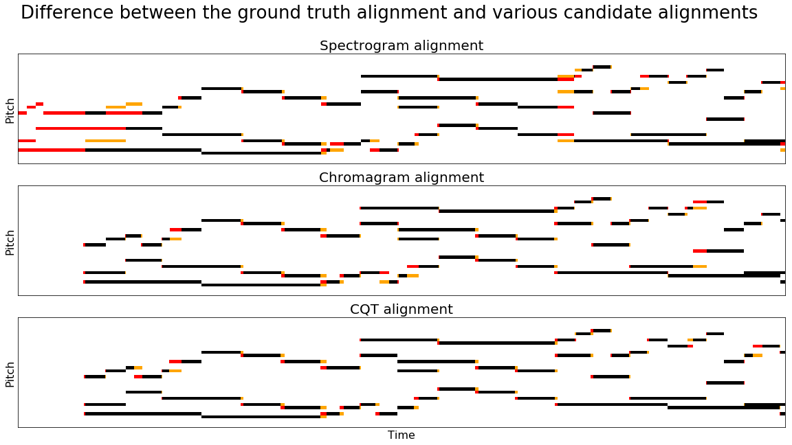

# music-alignment

To get started, first clone a copy of the Bach WTC scores:

```
https://github.com/humdrum-tools/bach-wtc
```

You'll also need a copy of the MAESTRO (v2.0) dataset:

```
https://magenta.tensorflow.org/datasets/maestro#v200
```

After downloading the scores and MAESTRO dataset, you can extract the aligmnent dataset
by calling the `extract` script from the root of this repository:

```
python3 extract.py {path-to-scores}/bach-wtc/ {path-to-maestro}/maestro-v2.0.0
```

The script will extract pairs of KernScores and MAESTRO performances to the data/ subfolder.

To generate the ground-truth alignments, run the following:

```
python3 align.py ground data/score data/perf N
```

The first argument specifes the alignment algorithm (written to an output directory of the same name).
The fourth argument 'N' specifies the number of parallel processes to run (N = 0 runs non-parallel)

You can generate audio-to-score alignments by specifying a particular alignemnt algorithm:

```
python3 align.py {spectra,chroma,cqt} data/score data/perf N
```

The alignments generated by the alignment script are stored in align/{ground,spectra,chroma,cqt} as
plaintext files with two columns: the first column indicates time in the score, and the second
column indicates time in the performance.

To evaluate the results of a particular alignment algorithm:

```
python3 eval.py {spectra,chroma,cqt} data/score data/perf
```



